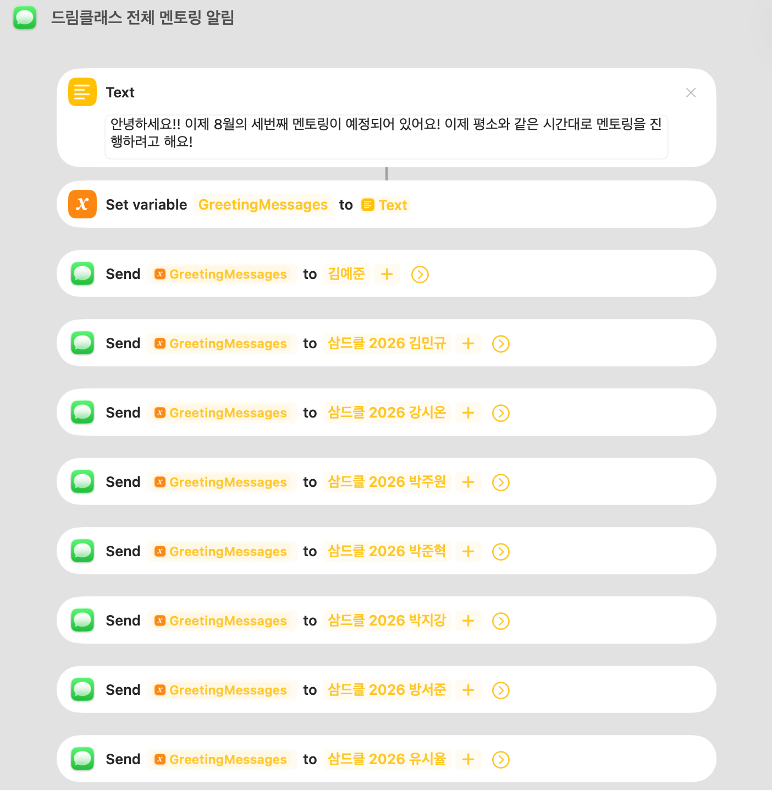
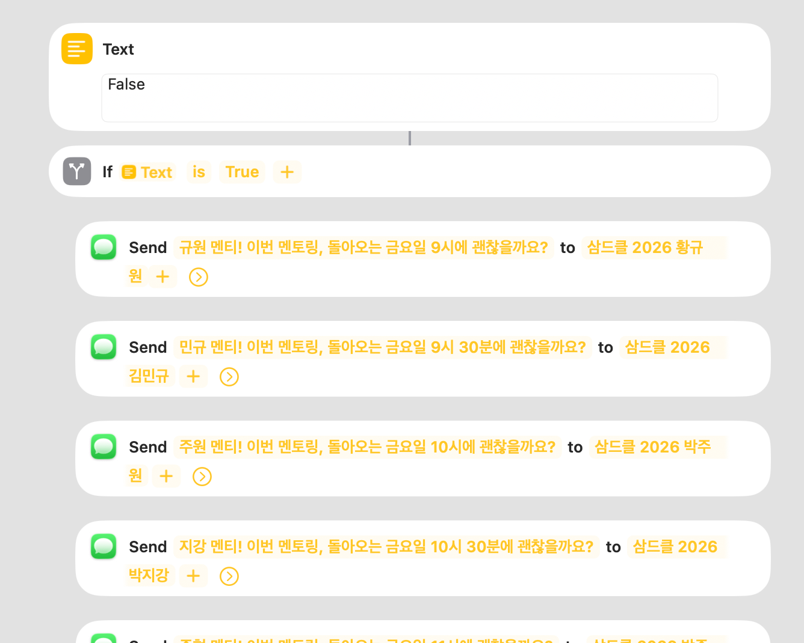
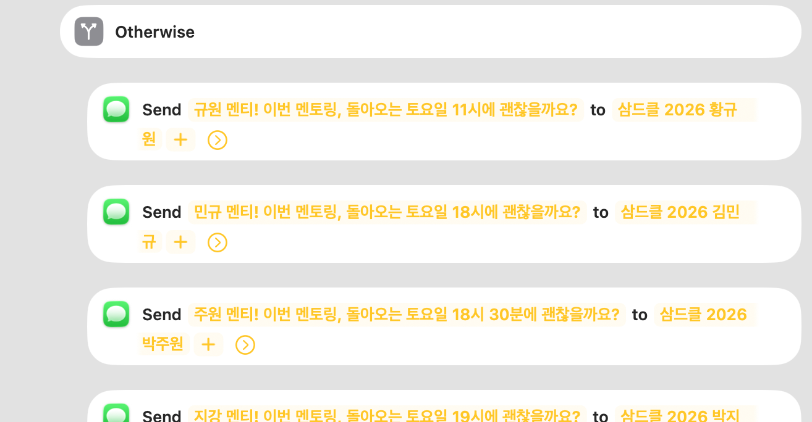
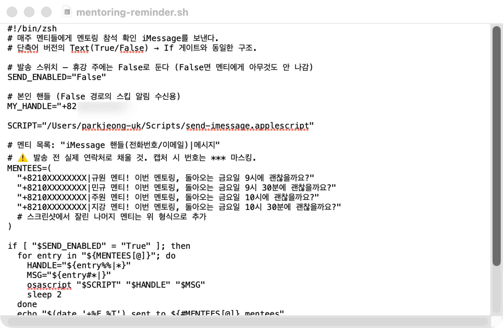
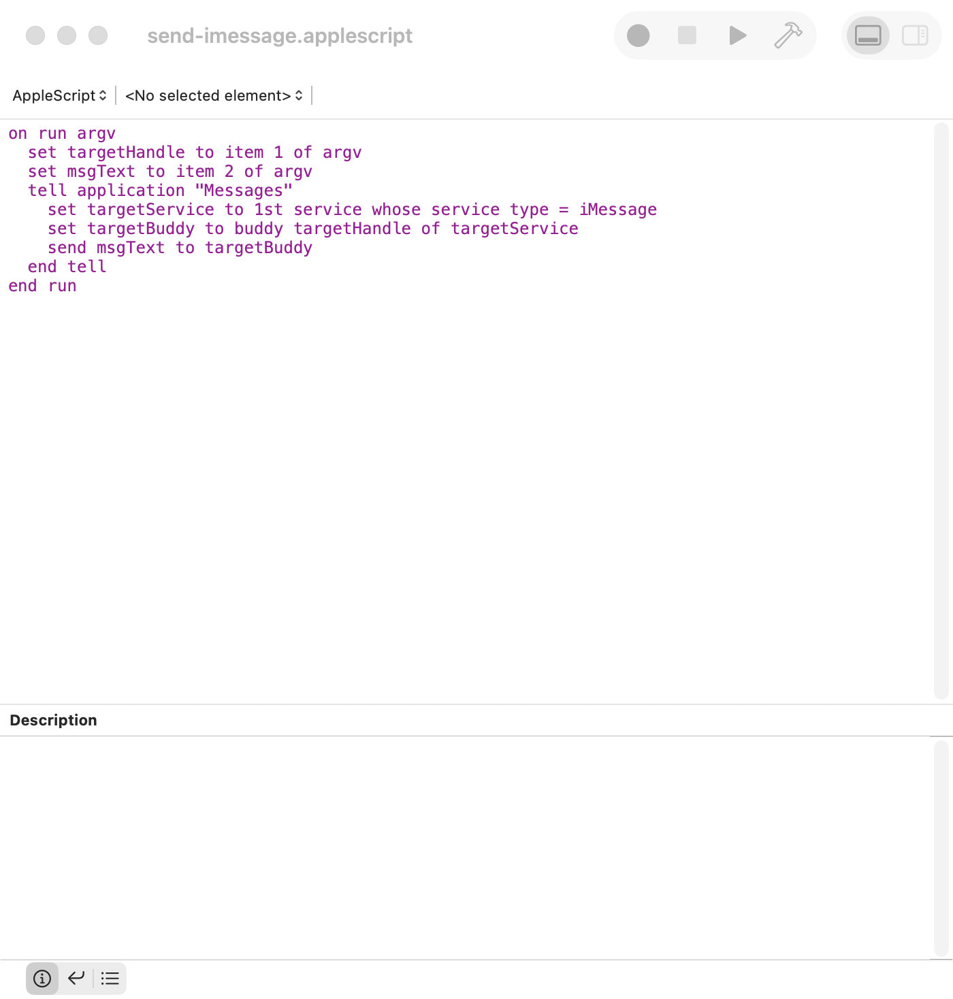
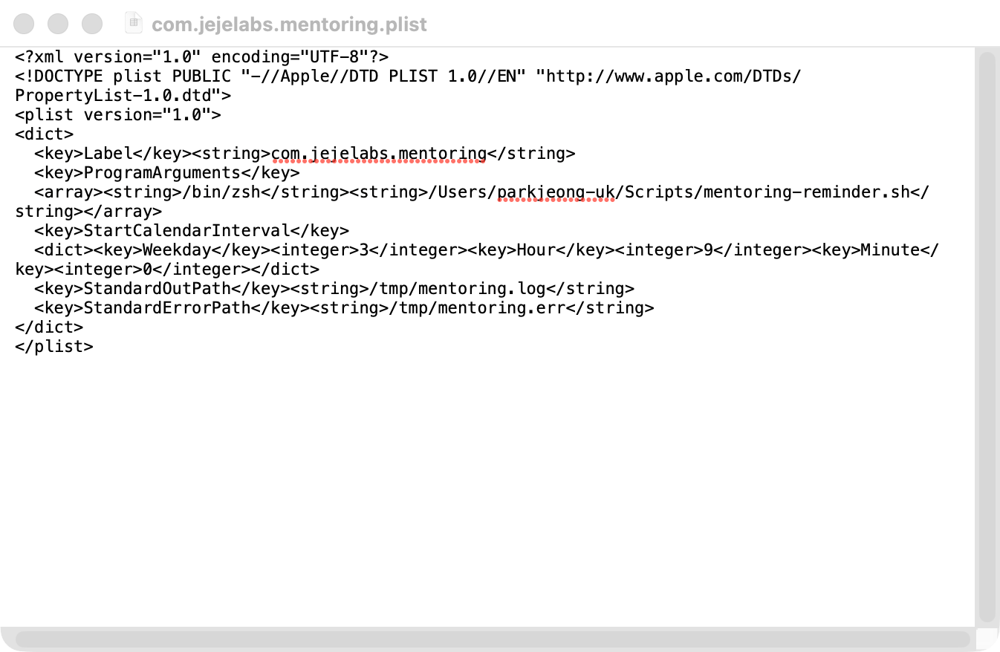
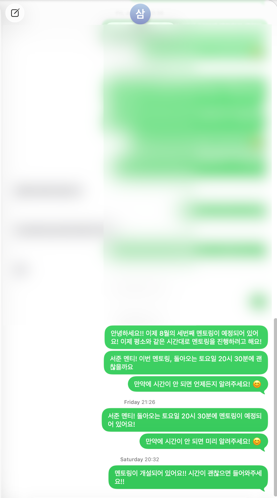
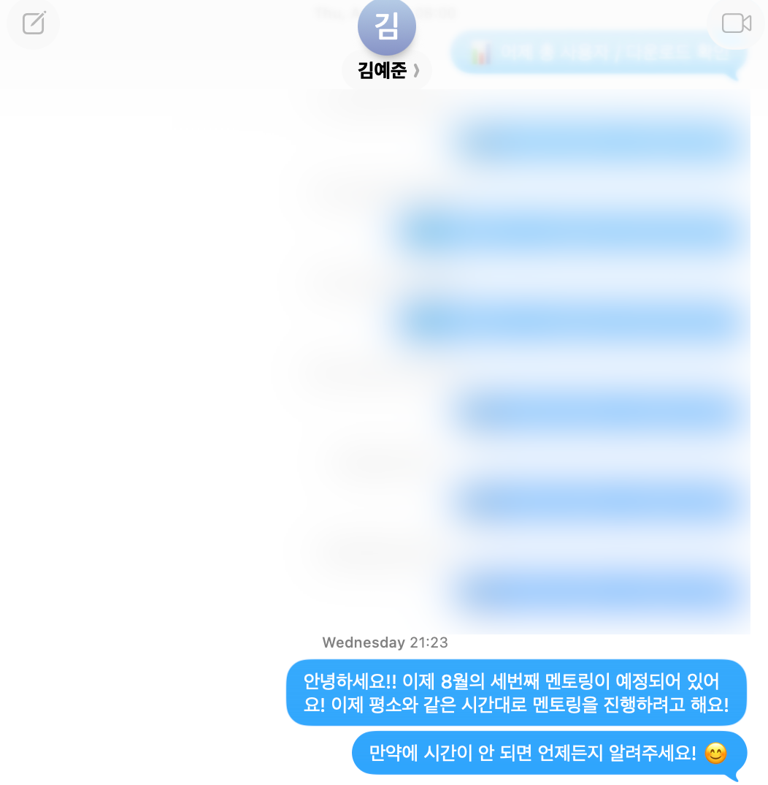
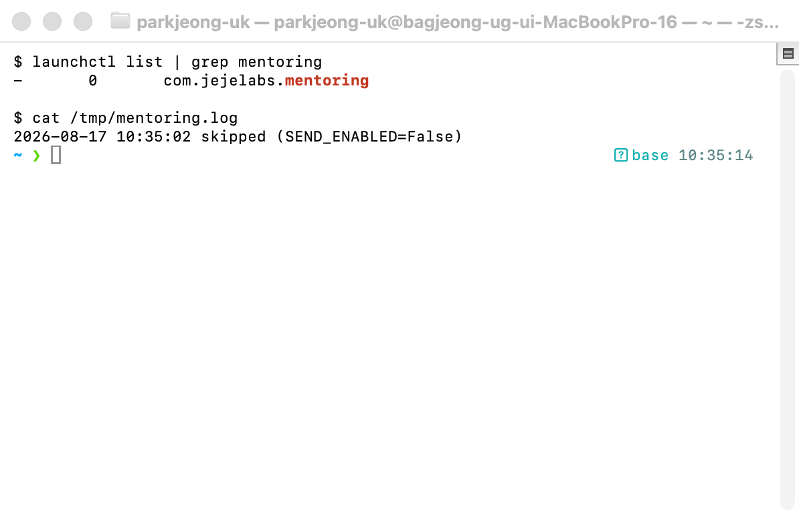

# Project 1 — 자동화 도구 비교 구현: Apple 단축어 vs iMessage 자동화(AppleScript + launchd)

> **워크플로우**: "매주 정해진 시각 → 조건 분기(금요일 주 True / 토요일 주 False) → 멘티들에게 각자 시간대의 멘토링 참석 확인 iMessage 자동 전송"
> 동일한 워크플로우 구조를 **Apple 단축어(Shortcuts)** 와 **AppleScript + launchd**(macOS에 내장된 스크립트·데몬 스택) 두 도구로 구현하고 비교한다.

---

## 1. 무엇을 자동화했나

매주 멘토링(드림클래스) 전에 멘티들에게 **각자 다른 시간대**로 "이번 멘토링, 괜찮을까요?" 확인 메시지를 보내는 루틴이 있었다. 주차에 따라 **금요일에 진행하는 주**와 **토요일에 진행하는 주**가 갈리는데, 한 명씩 복사해 요일·시간만 고쳐 보내다 보면 **시간대를 틀리거나 한 명을 빼먹는** 실수가 생기고, 보내는 시점도 매주 들쭉날쭉했다. 이걸 **매주 정해진 시각에 자동으로 전원에게 나가게** 만들었다.

- **금요일 주 (스위치 True)**: 금요일 시간표(9시 / 9시 30분 / 10시 / 10시 30분 …)가 박힌 확인 메시지가 멘티별로 전송된다.
- **토요일 주 (스위치 False)**: 토요일 시간표(11시 / 18시 / 18시 30분 / 19시 …)가 박힌 확인 메시지가 멘티별로 전송된다.

두 도구 모두 **같은 메시지 채널(iMessage)**을 쓴다 — 그래서 "무엇을 보내는가"가 아니라 **"무엇이 그 자동화를 돌리는가"**가 비교의 핵심이 된다.
- **단축어**: Apple의 **GUI 자동화 앱**. 액션을 리스트에 쌓아 만들고, iOS/Mac 어디서나 같은 방식으로 동작한다.
- **AppleScript + launchd**: macOS에 **원래 내장된 스크립트·데몬 스택**. `osascript`로 Messages.app을 직접 제어하고, macOS의 표준 스케줄러 `launchd`(cron의 macOS 후신)가 정해진 시각에 그 스크립트를 깨운다.

같은 "정시 → 스위치 분기 → 멘티별 메시지" 구조를 **그래픽 자동화 엔진 vs 코드 기반 자동화 엔진**으로 구현해 비교한다. 둘 다 **외부 서비스 가입·API 키·OAuth가 전혀 필요 없다** — Mac/iPhone에 로그인된 Apple ID의 iMessage를 그대로 쓰기 때문이다.

---

## 2. 워크플로우 구조 (두 도구 공통)

```
[Trigger] 매주 지정 시각 (예: 수요일 09:00)
   │   단축어 → 개인 자동화 "특정 시각" (요일 지정, 즉시 실행)
   │   AppleScript+launchd → launchd LaunchAgent의 StartCalendarInterval(Weekday)
   │
   ├─[조건 분기] 이번 주가 금요일 진행 주인가? (Text 스위치 True/False)
   │     ├─ True  → 금요일 시간표 확인 메시지 전송 (멘티별)
   │     └─ False → 토요일 시간표 확인 메시지 전송 (멘티별)
   │
   └─[Action] iMessage 전송
        단축어 → "메시지 보내기" 액션 ×4 (멘티별, 분기별 문구)
        AppleScript+launchd → 멘티 목록 루프 + osascript로 Messages.app 제어
```

- **Trigger 1개**: 매주 정해진 시각
- **Action 2개 이상**: 멘티별 확인 메시지 전송 ×4 (분기별 시간표 문구)
- **조건 분기 1개 이상**: 금요일 주/토요일 주 → 두 경로 모두 실제 1회 이상 실행(§5)

> 구현 단계는 `build-guide.md` 참고. 본 문서는 비교 분석에 집중한다.

---

## 3. 도구별 구현 요약

### [도구 A] Apple 단축어 (Shortcuts)

- **트리거**: `개인용 자동화 → 특정 시각 → 매주 지정 요일 → 실행 전 묻기 끄기(즉시 실행)`
- **분기(스위치)**: **텍스트** 액션에 `True`/`False`를 적어두고 `If (텍스트 is True)`로 게이트 — 이번 주 진행 요일에 맞춰 텍스트 하나만 바꾼다
- **True 경로(금요일 시간표)**: **"메시지 보내기(Send Message)"** 액션 ×4 — 멘티별 수신자·시간대 문구가 각각 들어간다
  - "규원 멘티! 이번 멘토링, 돌아오는 금요일 9시에 괜찮을까요?" → 삼드클 2026 황규원
  - "민규 멘티! 이번 멘토링, 돌아오는 금요일 9시 30분에 괜찮을까요?" → 삼드클 2026 김민규
  - "주원 멘티! 이번 멘토링, 돌아오는 금요일 10시에 괜찮을까요?" → 삼드클 2026 박주원
  - "지강 멘티! 이번 멘토링, 돌아오는 금요일 10시 30분에 괜찮을까요?" → 삼드클 2026 박지강
- **그 외(Otherwise) 경로(토요일 시간표)**: 같은 멘티들에게 토요일 시간대 문구로 전송 — "규원 멘티! … 토요일 11시…", "민규 멘티! … 토요일 18시…" 등
- **보조 단축어 "드림클래스 전체 멘토링 알림"**: 공지 문구를 변수(`GreetingMessages`)에 담아 멘티 전원에게 같은 내용을 일괄 브로드캐스트 — 시간대 개별 안내와 별도로 운영





### [도구 B] AppleScript + launchd

- **스크립트**: `mentoring-reminder.sh`가 분기 스위치로 금/토 시간표를 고르고, 해당 멘티 목록(`"핸들|메시지"`)을 돌며 `osascript`로 아래 AppleScript를 호출해 iMessage 전송

  ```bash
  #!/bin/zsh
  SEND_ENABLED="False"   # 안전 스위치 — True로 바꿔야만 실제 발송
  FRIDAY_PLAN="True"     # 조건 분기 — 단축어의 Text(True/False)와 1:1 대응

  FRIDAY_MENTEES=(
    "멘티1 핸들(***)|규원 멘티! 이번 멘토링, 돌아오는 금요일 9시에 괜찮을까요?"
    "멘티2 핸들(***)|민규 멘티! 이번 멘토링, 돌아오는 금요일 9시 30분에 괜찮을까요?"
    # …
  )
  SATURDAY_MENTEES=(
    "멘티1 핸들(***)|규원 멘티! 이번 멘토링, 돌아오는 토요일 11시에 괜찮을까요?"
    "멘티2 핸들(***)|민규 멘티! 이번 멘토링, 돌아오는 토요일 18시에 괜찮을까요?"
    # …
  )

  [ "$SEND_ENABLED" != "True" ] && { echo "skipped"; exit 0; }

  if [ "$FRIDAY_PLAN" = "True" ]; then MENTEES=("${FRIDAY_MENTEES[@]}")
  else MENTEES=("${SATURDAY_MENTEES[@]}"); fi

  for entry in "${MENTEES[@]}"; do
    osascript send-imessage.applescript "${entry%%|*}" "${entry#*|}"
    sleep 2
  done
  ```

  ```applescript
  on run argv
    set targetHandle to item 1 of argv
    set msgText to item 2 of argv
    tell application "Messages"
      set targetService to 1st service whose service type = iMessage
      set targetBuddy to buddy targetHandle of targetService
      send msgText to targetBuddy
    end tell
  end run
  ```
- **트리거**: `~/Library/LaunchAgents/com.jejelabs.mentoring.plist`에 `StartCalendarInterval`(Weekday·시·분)을 등록하고 `launchctl load`로 macOS 데몬(launchd)에 상주시킴 — 로그인 시각과 무관하게 매주 같은 시각에 실행
- **분기**: 스크립트 상단 `FRIDAY_PLAN` 변수(True=금요일 / False=토요일 시간표) — 단축어의 Text 스위치와 1:1 대응. 별도의 `SEND_ENABLED` 안전 스위치로 테스트 중 실수 발송을 막는다
- **전송**: `osascript send-imessage.applescript "핸들" "메시지"` — 받는 사람·내용을 인자로 받는 범용 전송 스크립트





---

## 4. 비교 분석 (10개 항목)

| # | 비교 항목 | Apple 단축어 (Shortcuts) | AppleScript + launchd |
|---|---|---|---|
| 1 | **성격** | GUI 기반 개인용 자동화 **앱** | macOS 내장 **스크립트 + 데몬** 스택(코드 기반) |
| 2 | **UI/UX** | 액션을 드래그·탭으로 쌓는 모바일 네이티브 리스트 | 텍스트 스크립트(`.sh`/`.applescript`)와 설정 파일(`.plist`)을 직접 작성 |
| 3 | **메시지 전송 방식** | 내장 "메시지 보내기" 액션으로 iMessage | `osascript` → `tell application "Messages"`로 iMessage — 채널은 동일, 제어 방식만 다름 |
| 4 | **트리거 방식** | 단축어 자체 "특정 시각" 자동화 엔진 | `launchd`의 `StartCalendarInterval`(macOS 표준 스케줄러) |
| 5 | **조건 분기** | Text 스위치 + `If` 액션(그래픽) | 셸 스크립트 변수 + `if`문(코드) |
| 6 | **수신자 여러 명 처리** | "메시지 보내기" 액션을 멘티 수만큼 복제 — 4명이면 4개, 늘어날수록 편집이 번거로움 | 목록(배열) + 루프 — 한 줄 추가로 멘티 확장, 문구 패턴 일괄 수정도 쉬움 |
| 7 | **기기 의존성** | iPhone·iPad·Mac 어디서나 동일하게 동작 | **Mac 전용** — Messages.app·launchd가 iOS엔 없음, Mac이 항상 켜져 있어야 함 |
| 8 | **실행 로그/실패 확인** | 빈약(실행 이력 추적 어려움) — 4명 중 누구에게 실패했는지 알 수 없음 | ✅ `launchctl list`로 로드 상태, `StandardOutPath`/`StandardErrorPath`로 발송·스킵 기록과 에러 원인 확인 가능 |
| 9 | **인증** | 불필요(iMessage가 기기의 Apple ID를 그대로 씀) | 불필요(동일) — 대신 최초 1회 "손쉬운 사용" 권한(터미널이 Messages 제어)을 허용해야 함 |
| 10 | **확장성/재사용성** | 단축어 공유 링크로 즉시 배포·복제 가능, 복잡한 조건 로직엔 한계 | 코드라 **버전 관리(git)**·복잡한 분기·외부 명령 조합에 강함. 실제로 Project 2(`dash.jejelabs.com`)처럼 코드 기반 자동화로 커지는 길이 여기서 시작된다 |

---

## 5. 실행 결과 (두 분기 경로 모두 실행 확인)

과제 요구: *각 분기 경로가 실제로 1회 이상 실행된 결과를 확인할 수 있어야 한다.*

| 경로 | 스위치 | 결과 | 캡처 |
|---|---|---|---|
| 금요일 시간표(True) | `True` | 금요일 시간대 문구가 멘티별로 전송 |  |
| 토요일 시간표(Otherwise) | `False` | 토요일 시간대 문구가 멘티별로 전송 |  |

**실제 발송된 iMessage 대화창** (토요일 경로 — "토요일 20시 30분" 안내, 개인정보 블러 처리)



**AppleScript+launchd 발송 및 로그** (`launchctl list` / `/tmp/mentoring.log`)




---

## 6. 장단점 정리

### Apple 단축어
- **장점**: 완전 무료 / 코드를 몰라도 몇 분이면 완성 / iPhone에서도 동작 / 공유 링크로 즉시 재사용
- **단점**: 실행 로그·실패 추적이 사실상 없음(누구에게 발송 실패했는지 모름) / 수신자가 늘면 액션 복제가 번거로움 / 기기가 꺼져 있으면 실행 안 됨

### AppleScript + launchd
- **장점**: 완전 무료 / **실행 로그·에러 확인 가능**(운영 신뢰성) / 멘티 목록을 배열로 관리해 확장 쉬움 / 코드라 git으로 버전 관리
- **단점**: 터미널·스크립트 문법을 알아야 함 / Mac 전용(iPhone 단독 실행 불가) / "손쉬운 사용" 권한 등 최초 설정이 GUI보다 번거로움

---

## 7. 어떤 상황에 적합한가 (의견)

- **단축어가 적합**: 코드를 모르는 사람이 몇 분 안에 만들 때, iPhone에서도 그대로 써야 할 때, 수신자·분기가 몇 개 수준으로 고정일 때.
- **AppleScript+launchd가 적합**: Mac을 상시 켜두고 서버처럼 쓸 때, 발송/스킵 여부를 로그로 남기고 추적해야 할 때, 수신자 목록이 계속 바뀌거나 다른 프로그램(Mail, Calendar, Finder 등)까지 엮어야 할 때.

**결론**: 배우고 바로 쓰기엔 **단축어**가 진입장벽이 가장 낮다. 하지만 "누구에게 실패했는지 알아채야 한다"는 요건이 생기는 순간 **로그가 있는 쪽**(AppleScript+launchd)이 필요해진다 — 이 지점이 바로 Project 2에서 소개하는 `dash.jejelabs.com`이 노코드 대신 코드 기반 자동화(Cloudflare Workers)로 간 이유와 같다.

---

## 8. 진입장벽·리스크 메모

- 두 도구 모두 **가입·API 키·유료 결제가 전혀 없다** — 과제의 "계정 진입장벽이 낮은 조합"을 그대로 만족한다.
- 유일한 리스크는 **AppleScript+launchd의 최초 권한 설정**이다: 터미널(또는 스크립트를 실행하는 프로세스)에 macOS "개인정보 보호 및 보안 → 손쉬운 사용" 권한을 한 번 허용해야 Messages.app을 제어할 수 있다. 이 과정과 실행 로그 확인 화면을 캡처로 남긴다.
- **민감정보**: 본인·멘티의 이름 일부와 전화번호/Apple ID는 스크린샷·문서에서 `***`로 마스킹한다. 실수 발송 방지를 위해 `SEND_ENABLED` 기본값은 `False`로 두고, 발송 시점에만 `True`로 바꾼다.
