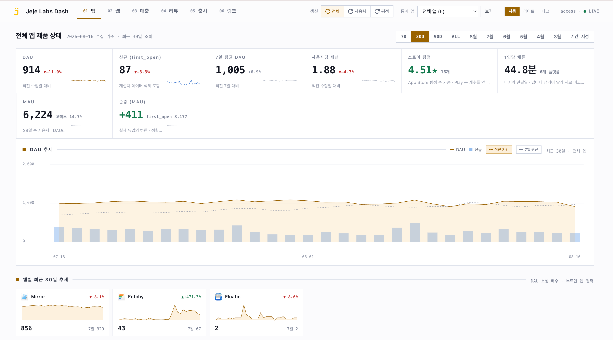
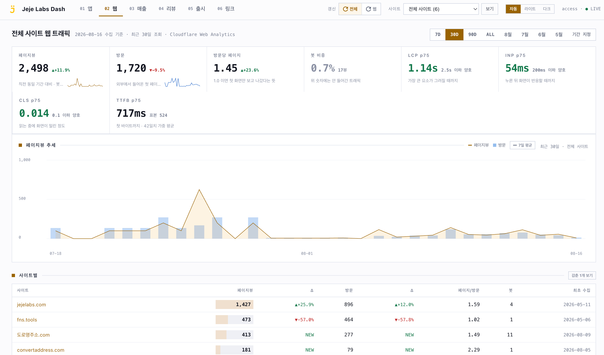
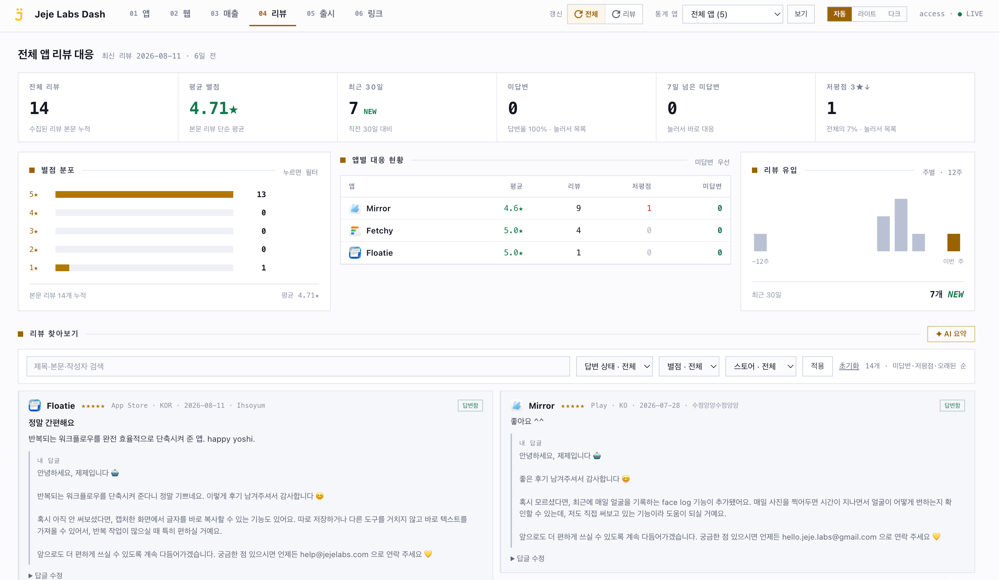
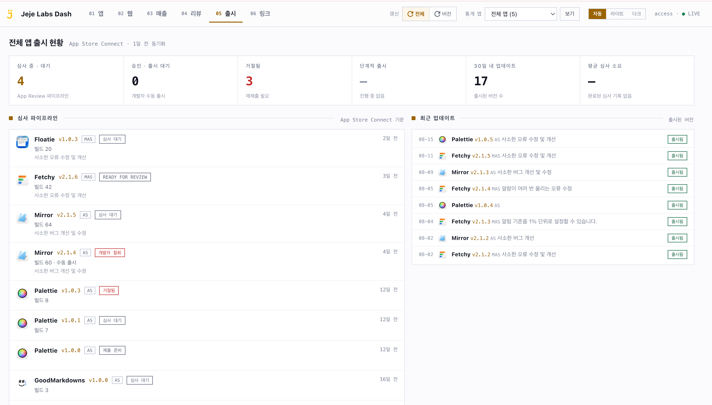
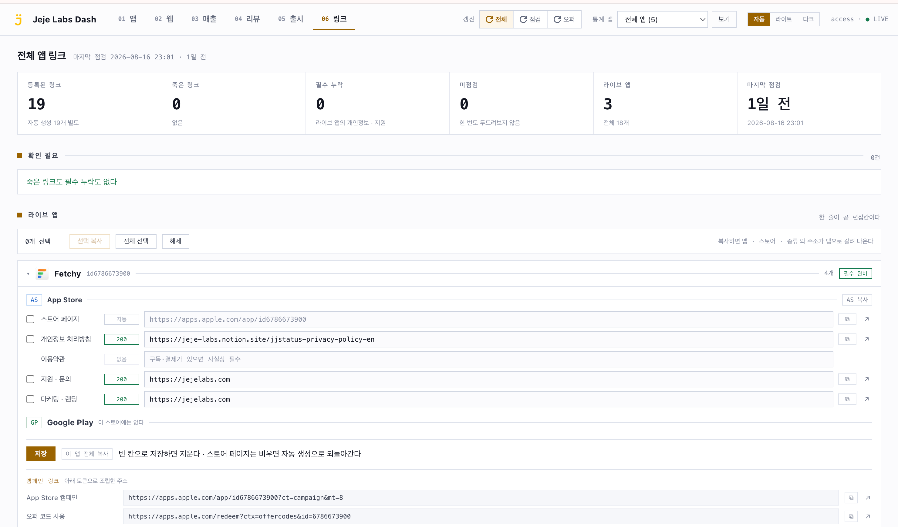
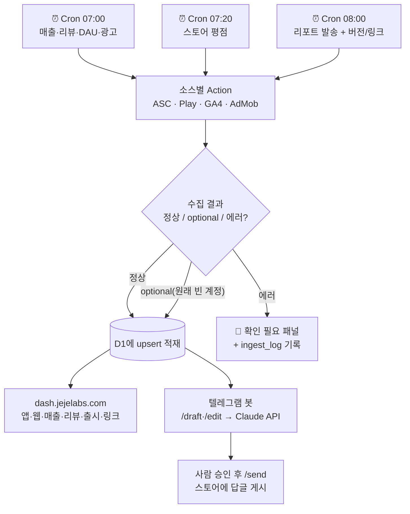
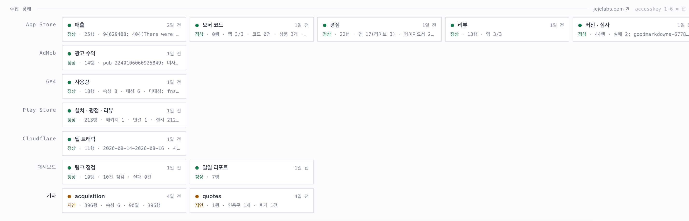
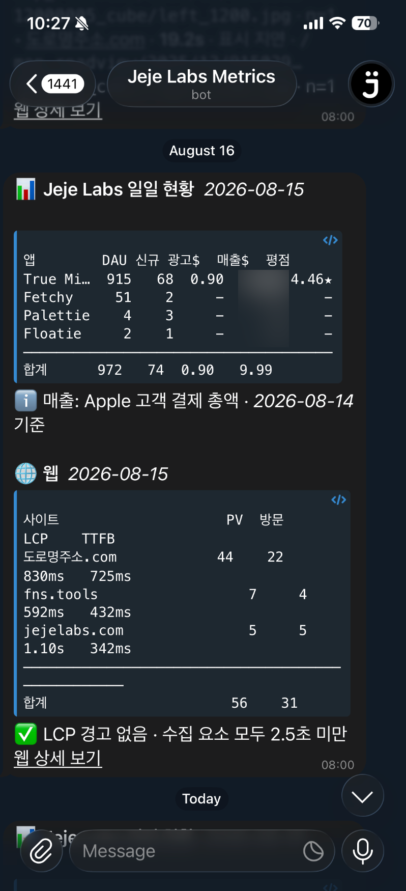
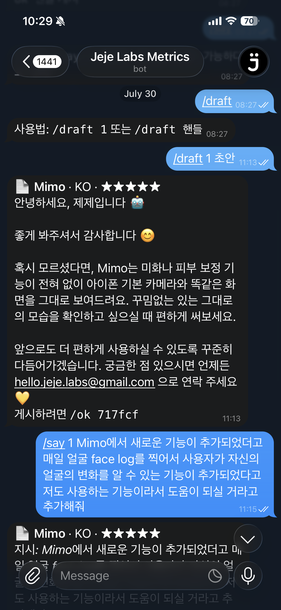
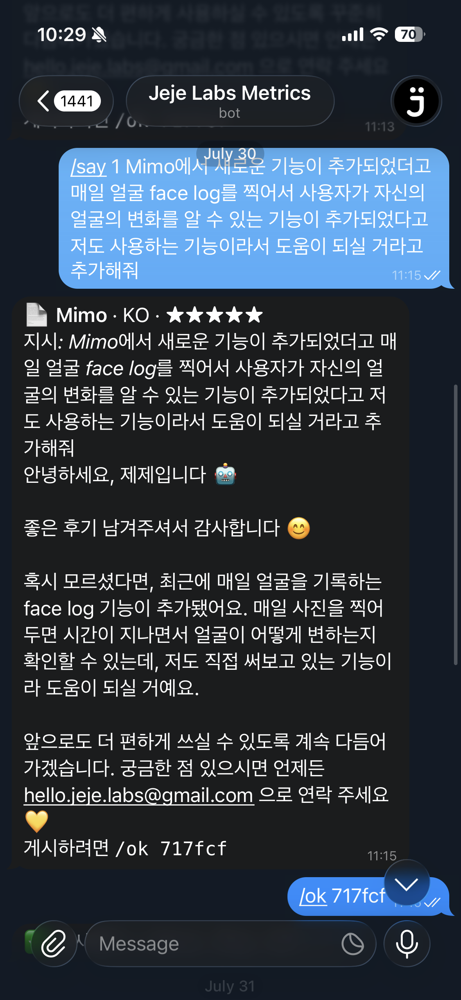

# Project 2 — 자유 주제 자동화: JejeLabs 통합 운영 대시보드 `dash.jejelabs.com`

> **반복 업무**: 앱마다 따로 있는 App Store Connect·Google Play Console·GA4·AdMob 콘솔에 매일 들어가 매출·다운로드·평점·리뷰·심사 상태를 확인하는 일
> **자동화**: Cloudflare Workers의 Cron 트리거가 매일 새벽 자동으로 모든 소스를 긁어 D1에 적재하고, 그 결과를 `dash.jejelabs.com` 한 화면(+ 텔레그램 봇)으로 받는다.
> **도구**: Make 같은 노코드 플랫폼이 아니라 **Cloudflare Workers(Cron Triggers) + D1 + Telegram Bot + Claude API** — 이미 실제 운영 중인 시스템을 그대로 문서화한다.

---

## 0. 반복 업무 정의 & 도구 선정 이유

운영 중인 앱이 여러 개가 되면서 매일 아침 **App Store Connect · Google Play Console · GA4 · AdMob**을 앱 수만큼 돌아가며 열어야 했다. 문제는:
- 콘솔마다 로그인·화면이 달라 **한 바퀴 도는 데만 10분 이상**.
- 스토어가 안 주는 지표(예: "지금 실제로 쓰고 있는 버전")는 GA4를 따로 봐야 하는 등 **소스가 흩어져 있어 비교가 안 됨**.
- 리뷰가 프랑스어·일본어 등 여러 언어로 오는데 **매번 새로 번역해 답글**을 달아야 함.

**도구 선정: Cloudflare Workers (Cron Triggers) + D1 + Telegram Bot + Claude API — Make 대신 코드 기반을 택한 이유**

| 후보 | 평가 |
|---|---|
| Make/Zapier 같은 노코드 | 소스별 페이지네이션·HMAC 서명·다단계 재시도·같은 데이터를 upsert로 매일 다시 정합화하는 로직은 노코드 모듈만으로 짜기 번거롭고, 무료 오퍼레이션 한도로도 앱 여러 개 × 소스 6개를 매일 못 감당 |
| **Cloudflare Workers(선정)** | 자체 도메인(`dash.jejelabs.com`)에 서버 렌더 대시보드를 직접 얹고 Zero Trust로 접근을 제한할 수 있음. Cron Triggers로 무인 스케줄, D1로 이력 누적, 무료 플랜 안에서 운영 가능(§2) |

즉 이번 자유 주제는 **"노코드로 배운 Trigger·Action·조건 분기 개념을 실제로는 코드로 어떻게 확장하는가"**를 보여주는 사례다 — 미션 소개에서 말한 "코드 기반 자동화로 확장"의 실물이다.

대시보드는 **앱(분석) · 웹 · 매출 · 리뷰 · 출시 · 링크**, 크게 6개 섹션(탭)으로 나뉜다. 아래 1~4는 이 중 **매출을 제외한** 주요 섹션 순서대로, **왜 각 섹션을 만들었는지**를 설명한다(매출 섹션은 수익 정보라 문서·캡처 범위에서 뺐다).

---

## 1. 분석 — "지금 실제로 쓰고 있는" 지표

**왜 만들었나**: 스토어 매출 리포트의 "버전"은 그날 *다운로드한* 버전이지 *쓰고 있는* 버전이 아니다. 새 버전이 얼마나 퍼졌는지, 어느 나라 사용자가 실제로 앱을 켜는지는 스토어가 절대 안 준다 — 이건 GA4(Firebase Analytics)로만 보인다.

- **Action**: GA4 Data API `runReport` 호출 → DAU·신규 사용자·세션·WAU·MAU, 버전별 사용자, 국가·기기별 사용자
- **분기 예**: 국가별 사용자 비중과 스토어 매출 국가가 어긋나는 경우(예: 사용자는 일본이 절반, 매출은 다른 나라 1위) "확인 필요" 표시로 강조 — 숫자만 나열하지 않고 이상치를 걸러낸다

별도의 **웹 탭**은 같은 화면에서 Cloudflare Web Analytics로 공개 사이트들(jejelabs.com 등)의 트래픽·Core Web Vitals까지 함께 본다 — 앱과 웹을 오가며 콘솔을 갈아탈 필요가 없다.

---

## 2. 리뷰 — AI 초안, 사람 게시

**왜 만들었나**: 리뷰가 프랑스어 1★, 일본어 5★처럼 여러 언어로 들어오는데 매번 사전 찾아가며 답글을 쓸 수 없다. 그렇다고 전부 자동 게시하면 맥락을 놓친 답글이 공개로 남는 리스크가 있다 — **초안은 AI, 게시는 사람**으로 나눴다. 이 흐름이 아래 **보너스 2**(리뷰 게시 + 실패 알림)의 무대다.

- **Action(생성형 AI 연동)**: Claude API로 리뷰 답글 초안을 생성. 리뷰 원문 언어(한국어가 아니어도)로 자동 작성하고, 이미 게시된 답글 톤을 참고
- **조건 분기**: 텔레그램 봇 명령이 두 경로로 갈린다 — `/draft`(AI가 내용까지 정함) vs `/say`(사람이 지시한 요지를 AI가 그 리뷰의 언어·톤으로만 옮김, 내용은 사람이 확정) → 환불·버그처럼 틀리면 곤란한 답변은 후자로, 나머지는 전자로 실제 운영에서 나뉘어 쓰인다
- **실행**: `/draft 1`(Claude 초안) → 필요하면 `/say 1 <지시>`(수정) → `/ok <확인코드>`(스토어에 게시)까지 폰에서 완결

---

## 3. 출시 — 심사 파이프라인이 멈춰 있는지

**왜 만들었나**: 새 버전을 올리고 나면 "심사 중인지, 거절됐는지, 단계적 출시가 몇 %인지"를 스토어 콘솔에 또 들어가 확인해야 했다. 특히 **아직 출시 전인 앱**이야말로 심사 상태를 가장 자주 보고 싶은데, 정의상 "출시된 앱" 목록에는 안 잡힌다.

- **Action**: App Store Connect에서 버전·빌드·심사 상태(`READY_FOR_SALE`, `IN_REVIEW` 등 원문 그대로 저장 — 나중에 Apple이 새 상태를 추가해도 놓치지 않도록)를 수집. **미출시 앱도 포함**해 하루 몇 개씩 돌아가며 재확인
- **Trigger 배치 이유**: 버전 수집은 앱당 호출 1개라 예산이 거의 안 들어 리포트 발송과 같은 크론 슬롯(08:00)에 얹었다 — 무료 플랜은 계정당 크론 슬롯이 5개뿐이라 슬롯을 아껴 쓴 결과

---

## 4. 링크 — 스토어 심사가 요구하는 링크, 그리고 실패 알림/재시도

**왜 만들었나**: 스토어 심사·지원 페이지가 요구하는 개인정보처리방침·약관·지원 URL을 앱마다 흩어 관리하다 죽은 링크를 뒤늦게 발견한 적이 있다. 여기서 **오래된 것부터 열 개씩 생사를 확인**한다. 이 섹션이 동시에 시스템 전체의 **실패 알림·재시도** 설계를 대표한다.

- **Action**: 링크 상태 확인(오래된 순 10개씩 — 앱 전체 × 소스가 많아 한 번에 다 돌리면 서브요청 예산이 바닥나므로 배치로 나눔)
- **실패 알림**: 모든 수집은 `ingest_log`에 성공/실패를 남기고, 실패나 이상치는 대시보드 "확인 필요 패널"에 표시된다(매일 아침 사람이 보는 화면 자체가 알림 역할)
- **재시도/대체 경로**: 스토어 리포트는 "어제 + 그제"를 **매일 다시** 당겨 Apple의 사후 정정을 자동으로 흡수하는 재시도 성격의 설계이고, AdMob 계정처럼 "원래 비어 있는" 경우는 `optional` 플래그로 오탐을 걸러 **진짜 실패만** 알림에 남긴다
- **보안**: 대시보드 도메인은 Cloudflare Access(Zero Trust)로 막혀 있고, 유일하게 열린 텔레그램 웹훅은 시크릿 설정 → 발신 IP 대역 → 시크릿 토큰 헤더 → chat_id, 4단계를 모두 통과해야 요청이 코드까지 들어온다

---

## 워크플로우 한눈에

**Trigger**는 Cloudflare **Cron Triggers 3개**(KST 07:00 / 07:20 / 08:00)다 — 무료 플랜은 요청 1건당 서브요청 50개가 한도라, 호출이 많은 평점 수집(소스 하나가 40개 이상 소모)을 별도 크론으로 쪼개지 않으면 뒤따르는 수집이 조용히 실패하기 때문이다.

---

## 조건 분기 — 두 경로 모두 실행된 증거

과제 요구: *각 분기 경로가 실제로 1회 이상 실행된 결과를 확인할 수 있어야 한다.*

**AdMob 계정 분기**: 수집이 진짜 실패한 계정은 `error`로 남겨 대시보드에 빨간 표시하고, 아직 앱을 안 올려 원래 비어 있는 계정은 `"optional": true`로 표시해 `미사용`으로만 기록하고 상태를 올리지 않는다 — 두 계정 모두 매일 이 분기를 실제로 통과한다.

대시보드 하단 **"수집 상태" 패널**이 이 분기의 결과를 소스별 카드로 그대로 보여준다:

| 경로 | 캡처에서 보이는 것 |
|---|---|
| 정상/무시 | AdMob(광고 수익) 카드가 초록 `정상`에 `미사…(미사용)`으로만 기록 — optional 계정이 에러로 승격되지 않고 분기의 무시 경로를 탔다 |
| 에러/알림 | 수집이 실패하면 같은 카드가 `error`로 표시된다. 캡처 시점에도 버전·심사 카드에 부분 실패가 "실패 2: goodmarkdowns-…"로 인라인 기록돼 있고, 오래 안 돈 수집은 주황 `지연`으로 구분된다 |

---

## 보너스 구현

### 보너스 1 — 매일 아침 현황 알림 자동 생성

매일 아침 8시(KST) 크론이 전날 수집 결과를 **요약 메시지로 자동 생성**해 텔레그램으로 발송한다 — 앱별 DAU·신규·광고·평점 표, 웹 PV·LCP·TTFB 표, 그리고 "✅ LCP 경고 없음" 같은 자동 판정 문구까지. 아침에 폰만 봐도 어제 상태 확인이 끝난다. (텍스트 생성형 AI(Claude)는 아래 보너스 2의 리뷰 답글 초안 Action에 연동돼 있다.)

### 보너스 2 — 리뷰 답글 게시 + 실패 알림

`/draft`(Claude가 초안 생성) → `/say <지시>`(사람 지시를 그 리뷰의 언어·톤으로 반영해 재작성) → `/ok <확인코드>`(스토어에 실제 게시). 게시 API 호출이 실패하면 그 자리에서 텔레그램으로 실패 응답이 오고 `ingest_log`에 남는다 — 초안 생성부터 게시 성공/실패 확인까지 폰에서 완결된다. 확인코드(`/ok 717fcf`)를 한 번 더 요구하는 것 자체가 잘못된 리뷰에 잘못된 답글이 게시되는 사고를 막는 안전장치다.

---

## 전제조건 & 과금·보안 메모

- **전제**: App Store Connect API 키(팀 단위), Google Play 서비스 계정, GA4 서비스 계정, AdMob 계정, Telegram 봇 토큰, Anthropic API 키가 필요하다. 전부 Cloudflare Workers의 **Secrets**(`wrangler secret put`)로 저장하고 리포지토리에는 값이 남지 않는다.
- **과금**: 현재 Cloudflare Workers **무료 플랜**(요청당 서브요청 50개 한도) 안에서 크론을 3개로 쪼개 운영 중이다. 한도를 더 넉넉히 쓰려면 Workers 유료($5/월, 서브요청 1000개)로 올리면 되지만 **아직은 무료로 충분해 유료 전환이 불가피하지 않았다**. Anthropic API(Claude)는 리뷰 답글 초안 생성분만 종량 과금되며 사용량이 적어 월 비용이 크지 않다.
- **보안**: 대시보드 도메인·계정 이메일·API 키/토큰은 스크린샷·문서에서 `***`로 마스킹한다. vendor number·Property ID 등 계정 식별값도 동일하게 가린다.

---

## 부록 — "리뷰"는 dash.jejelabs.com 안에서 끝나지 않는다: 공개 사이트 jejelabs.com과의 연동

2번 섹션(리뷰)에서 처리한 결과가 **비공개 운영 대시보드(`dash.jejelabs.com`) 밖으로도** 이어진다.

- 답글이 달린 리뷰 중 **4★ 이상 + 본문이 있는 것만** 한국어·영어·일본어 인용구로 정리해 `review_quotes` 테이블에 별도 저장한다.
- 이 데이터는 인증이 없는 공개 엔드포인트 **`/public/reviews.json`**로 나간다. 단, `SELECT *`가 아니라 **화이트리스트로 고른 컬럼만** — 내부 리뷰 ID나 AI 초안 같은 건 절대 같이 나가지 않는다. 인증이 없는 경로라 엣지 캐시를 먼저 확인해, 무료 플랜의 하루 D1 읽기 한도를 이 엔드포인트 하나가 다 써버리지 않게 막는다.
- 그 JSON을 회사 공개 마케팅 사이트 **`jejelabs.com`**(별도 프로젝트 `JejeLabs-Web`)의 `companion.js`가 읽어, 방문자가 보는 언어에 맞춰 **실제 리뷰 인용구를 화면에 띄운다.** 페이지에 `data-jj-app` 속성을 주면 특정 앱 리뷰로 범위를 좁힐 수도 있다.

즉 이 자동화의 산출물은 두 갈래로 쓰인다 — **운영자용**(dash.jejelabs.com의 확인 필요 패널·텔레그램 봇)과 **방문자용**(jejelabs.com에 노출되는 실제 고객 후기). 같은 파이프라인이 "우리가 볼 것"과 "고객이 볼 것"을 동시에 만들어낸다는 점에서, 하나의 트리거·액션 체인이 서로 다른 두 목적에 재사용되는 사례로 볼 수 있다.
