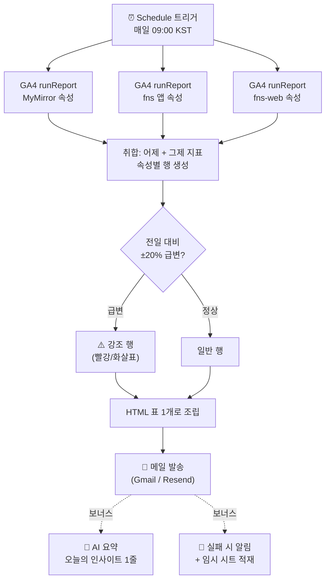

# Project 2 — 자유 주제 자동화: 멀티 GA4 통합 일일 리포트 메일

> **반복 업무**: MyMirror · fns 앱 · fns-web 의 Google Analytics를 매일 **각각 따로** 들어가 확인하는 일
> **자동화**: 세 GA4 속성의 어제 지표를 한 번에 모아 **매일 아침 한 통의 메일**로 받는다.

---

## 1. 반복 업무 정의

운영 중인 제품마다 GA4 속성이 따로 있다.

| 제품 | 종류 | 분석 소스 |
|---|---|---|
| MyMirror | iOS/Android 앱 | Firebase Analytics → GA4 속성 |
| fns 앱 | 데스크톱 앱 | Firebase Analytics → GA4 속성 |
| fns-web (fns.tools) | 웹사이트 | GA4 (측정 ID `G-***`) |

매일 아침 GA 콘솔에 들어가 **속성을 하나씩 전환해가며** 어제 사용자·신규·세션을 확인했다. 제품이 늘수록 클릭과 전환이 비례해서 늘고, 빼먹는 날도 생겼다. **"세 곳을 한 통의 메일로 합쳐서 받자"** 가 이 자동화의 목표다.

---

## 2. 도구 선정: Make (선정 이유)

| 후보 | 평가 |
|---|---|
| **Make (선정)** | GA4 Data API를 HTTP/구글 모듈로 호출 → 여러 속성을 **반복·취합**하기 좋다. 무료 1,000 ops/월 안에서 매일 실행 가능. 실행 히스토리로 실패 추적이 쉬움. Project 1에서 이미 익혀 학습비용 0 |
| n8n | 셀프호스팅 무제한이지만 서버 운영 부담. 단일 통합 리포트엔 과함 |
| 단축어 | 다중 API 취합·표 조립·메일 발송 조합엔 로그/안정성이 부족 |

**선정 이유 요약**: ① GA4 속성 3개를 순회하며 데이터를 모으고 표로 합치는 "취합형" 작업에 모듈형 플로우가 적합 ② 매일 무인 실행이 필요해 클라우드 스케줄이 맞음 ③ 무료 범위 충족 ④ 모듈 단위 실행 로그로 어느 속성 조회가 실패했는지 바로 확인 가능.

---

## 3. 워크플로우 흐름

### 다이어그램



### 단계 설명

1. **[Trigger]** 매일 09:00 스케줄 실행 (Trigger 발생 시 자동 실행 — 과제 제약 충족)
2. **[Action ①]** GA4 Data API `runReport`로 세 속성의 **어제·그제** 지표 조회
   - 지표: `activeUsers`(활성 사용자) · `newUsers`(신규) · `sessions`(세션) · `eventCount`(이벤트)
   - 앱·웹 공통으로 존재하는 지표만 사용해 한 표로 합치기 쉽게 함
3. **[조건 분기 / Router]** 속성별 **전일 대비 변동률** 계산 → `±20% 이상`이면 ⚠️ 강조 경로, 아니면 일반 경로
4. **[Action ②]** 세 속성 결과를 **HTML 표 한 개**로 조립
5. **[Action ③]** 완성된 표를 **메일 한 통**으로 발송
6. **(보너스)** AI 요약 Action · 실패 알림/재시도

### 받는 메일 예시(텍스트)

```
📊 데일리 통합 리포트 — 2026-06-22 기준 (어제)

제품          활성   신규   세션   변동(전일대비)
─────────────────────────────────────────────
MyMirror      128    14     156    ▲ +32%  ⚠️
fns 앱         64     5      71     ─  +3%
fns-web       402    88     510    ▼ -21%  ⚠️
─────────────────────────────────────────────
합계          594    107    737

🤖 인사이트: MyMirror 신규가 어제 급증했습니다. 유입 출처를 확인해 보세요.
```

> 스크린샷: `./screenshots/p2-make-scenario.png` (시나리오 전체), `./screenshots/p2-make-ga-module.png` (GA4 조회 모듈), `./screenshots/p2-result-email.png` (수신 메일)

---

## 4. 조건 분기 — 두 경로 실행 확인

| 경로 | 조건 | 실행 예시 | 캡처 |
|---|---|---|---|
| ⚠️ 강조 | 전일 대비 ±20% 이상 변동 | MyMirror ▲+32%, fns-web ▼-21% | `./screenshots/p2-branch-alert.png` |
| 일반 | 변동률 ±20% 미만 | fns 앱 +3% | `./screenshots/p2-branch-normal.png` |

제품이 3개라 보통 하루에 **강조·일반 경로가 동시에** 발생한다 → 두 분기 경로 모두 1회 이상 실행됨이 자연히 확인된다.

---

## 5. 보너스 과제

### 보너스 1 — AI 연동 Action (요약 생성)

취합된 표 데이터를 Make의 HTTP 모듈로 **Claude/GPT API**에 전달해 "오늘의 인사이트" 한 줄을 자동 생성하고 메일 하단에 붙인다.
- 프롬프트 예: *"다음 3개 제품의 어제/그제 지표다. 가장 주목할 변화 1가지를 한국어 한 문장으로 요약해라."*
- 캡처: `./screenshots/p2-bonus-ai.png`

### 보너스 2 — 실패 알림 및 재시도/대체 경로

- **실패 알림**: 어느 속성 조회나 메일 발송이 실패하면 Make의 Error handler로 **카카오/메일 알림** 발송
- **재시도**: HTTP 모듈에 `Retry` 설정(예: 2회, 지수 백오프)
- **대체 경로**: 메일 발송 실패 시 결과를 **임시 Google Sheets에 적재**해 데이터 유실 방지
- 캡처: `./screenshots/p2-bonus-errorflow.png`

---

## 6. 전제조건 & 과금·보안 메모

- **전제**: 세 GA4 속성이 **하나의 구글 계정**에서 모두 보여야 한다(OAuth 1회로 전부 접근). 모바일 앱(MyMirror·fns 앱)은 Firebase Analytics가 곧 GA4라 자동으로 속성이 생성되며 동일 API로 조회된다. 각 속성의 **숫자 Property ID** 필요(GA4 관리 > 속성 설정).
- **과금**: GA4 Data API는 무료. Make 무료 1,000 ops/월 안에서 동작(매일 1회 × 속성 3개 + 분기/메일 ≈ 월 150~300 ops). 유료 결제 없이 완수.
- **보안**: 메일 주소·Property ID·OAuth 토큰·서비스 계정 키는 스크린샷/문서에서 `***`로 마스킹한다.

> 구현 단계(GA4 Data API 호출, 멀티 속성 순회, 메일 모듈 설정)는 `build-guide.md` 참고.
```
